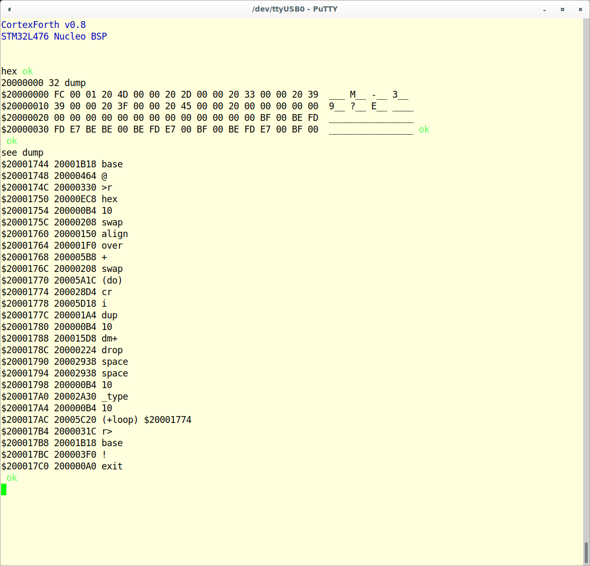

# CortexForth
A simple implementation of Forth for ARM Cortex-M3 and M4 devices.



CortexForth is a direct threaded implementation of the forth language for the
ARM Cortex-M3 and Cortex-M4 family of CPUs. It is not ANSI compliant although
it strives to be whenever possible.
The source code is under [Apache 2.0 License](http://www.apache.org/licenses/LICENSE-2.0).

## Dictionary Structure
Each word in the dictionary is made up of several fields, **all of them
aligned to a 32 bit boundary**. In order of increasing memory address,
a given word will have the following fields:
### LFA
This field is a link to the previous word in the dictionary. This number will
be 0 at the head of the dictionary.
### NFA
This is the name of the Forth word, made up by a byte with the following bit fields:

```
| bit |  Name |          Description            |
| ----| ----- |-------------------------------- |
| 7   | IMMED |Set if the word is immediate.    |
| 6   | COMPO |Set if the word is compile only  |
| 5   | ASMWR |Set if the word is in CODE       |
| 4:0 | LEN   |Length of the word's name        |
```

In the case where the length of the string plus the letters do not sum up to a
multiple of 4 the memory address is alinged to a 32 bit boundary.
### CFA
This field holds different values depending on wether the word is a CODE or a
COLON one
* In a CODE word there will be executable code
* In a COLON word there will be the `ENTER` instruction

## Inner Interpreter
### Register Usage
It is easier to understand the workings of the inner interpreter if the content
of the relevant registers of the CPU are defined upfront.
* `R0` always contains the top of the parameter stack (TOS)
* `R1` is the instruction pointer (IPP)
* `R2` points to the Parameter Stack (PSP)
* `R3` points to the Return Stack (RSP)
* `R7` contains the address of doList, a piece of code that saves the IP in
the returns stack and loads a new value.

Register R4 through R6 are used as working registers during some operations and
are not guaranteed to remain the same from one word to another.

The use of the first 8 registers for all the interpreter code should simplify an
eventual port to Cortex-M0/M0+ devices.

### ENTER
`ENTER` is a Forth construct that is used by COLON words to save the IP and
load the IP register with a new value. CODE words do not have an `ENTER`
construct and in this case there is actual executable code instead of
`ENTER`. The Forth `ENTER` instruction is implemented by the the assembly
instruction `BLX R7`. In this case the value of the R8 register has been
preloaded with the contents of doList code and will not change. The doList
code looks like this

```
doList:         PUSHH       IPP, RSP      @ Push IP into return stack.
                add         IPP, lr, #1
                ldr         pc, [IPP], #4
```
The first instruction (PUSHH) is a macro that unrolls into `STR IPP, [RSP], 4`.
It saves the current value of the IP into the return stack. Since we arrive
at this part of the code through a BLX instruction the value of the `LR`
register has its LSb set (ARM Thumb bit).

The second instruction, `add IPP, lr, #1` is a bit tricky. The header of each
word makes sure that the `BLX R7` instruction that implements ENTER will be on
a word boundary by padding the ASCII name with 0s when needed. The `BLX R7`
assembler instruction itself is 2 bytes long and is followed by 2 bytes at 0
to reach the next word boundary. When the instruction is
executed the content of the `lr` register will have its bit 0 set
(ARM Thumb bit), so it will not be pointing to the byte immediately following
the `BLX R7` instruction but rather to the one past it. By adding 1 to the `lr`
register at this stage we effectively achieve two goals:

- Clear the Thumb bit
- Align the value in `lr` to a 32 bit boundary

The last goal is important because now the LR register is on a 32 bit boundary
where the first token of the word is. While the Cortex-M3 and M4 support
unaligned accessed, a 32 bit boundary significantly speeds up execution.

In order for this scheme to work we need to guarantee that, per ARM Cortex-M
specification, the value loaded in the PC register has the Thumb bit set. This
requirement is taken care in the header of each word, where a 1 is automatically
added to the label that carries the address of each word (see the body of the
`CODE` macro for details.)

Strings are also aligned to a word boundary and when needed are automatically
padded with enough 0s to reach a 32 bit boundary so that even in the case of
Forth words with embedded strings we still maintain alignment of the execution
tokens following the string.

The last instruction is the inner interpreter, and loads the value of the
program counter (`PC`) register with the new IP, post-incrementing the IP in
the process. This instruction is CortexForth's implementation of Forth's
`NEXT` instruction.

## Word Definition
### COLON words
The user can add words to the dictionary within the source code. As an example
of how a typical COLON word looks like in the source code the following is
the source for the `dump` word. It dumps the content of an area of memory
in HEX, with the corresponding ASCII (when printable):

```
@ dump ( a u -- )
@ Dump u bytes from a, in a formatted manner.
@
@ : dump
@     base @ >r         \ Save the current base.
@     hex               \ Work in hexadecimal now.
@     16 swap align     \ Round up the length to the next multiple of 16.
@     over + swap       \ Prepare do-loop limits
@     do
@       cr
@       i dup 16 dm+ drop \ Print 16 bytes.
@       space space     \ Separators between HEX and ASCII.
@       16 _type        \ Prints ASCII characters.
@       16
@     +loop
@     r> base ! ;
                COLON       forth_link_address, 0, dump, dump
                .word       base, at, tor, hex
                .word       dolit, 16, swap, align
                .word       over, plus, swap
                .word       xdo
1:              .word       cr
                .word       index, dupp
                .word       dolit, 16, dumpp, drop
                .word       space, space
                .word       dolit, 16, utype
                .word       dolit, 16
                .word       xploop, 1b
                .word       rfrom, base, store
                .word       exit
```

The COLON macro does all the work of creating the header for the word,
including the LFA and the NFA, maintaining 32 bit alignments of each part of
the header. Throughout the source code there are words with names that include
characters that can confuse the `gnu` assembler and in this case the
`COLON` macro cannot be used. For these spacial cases we have to build the
header manually. An example from the source code follows:

```
@ ."| ( -- )
@ Run time routine of ." . Output a compiled string.
@ We need to create this header by hand, since '.' is the start of directive
@  commands and that confuses the assembler.
@
@ : ."|
@     do$           \ Address of compiled string.
@     count         \ Length.
@     type ;        \ Emit the characters.
                make_link   forth_link_address
                .byte       COMPO + 3
                .ascii      ".\"|"
                .align      2, 0
                .equ        dotqp, . + 1
                ENTER
                .word       dostr
                .word       count
                .word       types
                .word       exit
```

* The `make_link` macro creates the LFA. The parameter forth_link_address in
this case specifies in which dictionary the word belongs.
* The `.byte` assembler directive creates the word length. Notice that in
this case there is a lexicon bit added to make this word a `COMPILE TIME ONLY`
word
* Next we align, if needed, the address before the macro that implement `ENTER`
* The `.equ` assembler directive creates a label that can be used by other
words to reference this word for execution. Notice that we add 1 to the value
of the program counter to account for the Thumb bit needed by the `BLX R7`
instruction.
* Following `ENTER` we have the Forth words. The last word is, with few
exceptions, `exit`, which eventually resolves to `NEXT`.

### CODE words
`CODE` words are similar in their making to `COLON` except that their body
is made up of excutable code. As an example the following is the
```
@ here ( -- a )
@ Return the top of the code dictionary.
@
@ : here dp @ ;
                CODE        forth_link_address, 0, here, here
                PUSHH       TOS, PSP
                ldr         TOS, 1f
                ldr         TOS, [TOS]
                m_next
1:              .word       dtop_var
```

In this case the `CODE` macro builds a `CODE` word header. There is no
`ENTER` and executable code immediately follows the header.

### COLON Words implemented as CODE
CortexForth defines the body of dozens of simpler words as macros that can
then be used to write `CODE` words in the fashion of `COLON` ones. The names
of these macros always begin with m_.This technique is not always a good idea
given that there is a lot of code replication but it can be effective for time
sensitive code. Following is a comparison of te same word writen in both ways,
as a `COLON` first followed by the equivalent `CODE`:

```
@ do$ ( -- a )
@ Return the address of a compiled string.
@
@ : do$
@     r>            \ This is the return address to the word following the
@                   \  call to 'dostr' which more likely than not is the
@                   \  address of 'count' within 'dotqp'.
@     r>            \ This is the address to the start of the string that
@                   \  must follow 'dotqp'.
@     dup           \
@     count         \ Calculate the length of the string.
@     +             \ Add that to the string pointer to get the address of the
@                   \  last byte of the string.
@     aligned       \ Align to a cell boundary to find the addres of the next
@                   \  instruction after the string.
@     >r swap >r ;  \ Store back to RSP.
                COLON       forth_link_address, COMPO, do$, dostr
                .word       rfrom, rfrom, dupp, count, plus
                .word       aligned, tor, swap, tor, exit

@ : do$ ( --- a )
@     r>            \ This is the address to the start of the string that
@                   \  must follow 'dotqp'.
@     dup           \
@     count         \ Calculate the length of the string.
@     +             \ Add that to the string pointer to get the address of the
@                   \  last byte of the string.
@     aligned       \ Align to a cell boundary to find the addres of the next
@                   \  instruction after the string.
@     >r ;          \ Store back to RSP.
                CODE        forth_link_address, COMPO, do$, dostr
                m_rfrom
                m_dupp
                m_count
                m_plus
                m_aligned
                m_tor
                m_next
```
Notice how the two words are slightly different on account of the fact that
the `CODE` implementation does not call `ENTER` and thus does not store the
IPP on the Return Stack, which in turn requires the pulling of one fewer
word from it.

This technique can lead to faster execution times, at the expense of memory
utilized, since each macro can unroll into serveral assembly instructions.
With Cortex-Mx devices memory is rarely a problem so this technique
can occasionally be useful.

The files m_forth.S and m_composites.S contain the macro that implement
several Forth words in assembler.

Some fairly complicated CortexForth words are defined as `CODE` while
maintaining their `COLON` nature. In other words, some COLON definitions have
been turned into CODE ones by simply replacing each token with the corresponding
assembler macro. See for example `(find)` or `-parse`.

This technique is not always possible, being limited to definitions that use
simple operations.

# BSP files
## Required Words
CortexForth has been designed to be easy to port to any Cortex-M3 or Cortex-M4
device. All the device-specific logic is contained in a Board Support Package
(BSP) that must implement at least 4 words.

* **hwsetup** ( -- ) Performs all hardware initialization. At a minimum
initializes the board clocks and the serial port. This function is the first
word called during the boot of the Forth interpreter
* **?rx** ( -- c T | F) Reads a character from the serial port. Returns the
character (and TRUE) if a character is available or FALSE if no character is
available
* **tx!** ( c -- ) Send character c to the output device. This is a synchronous
call, in that it waits until the USART hardware is ready to send the next
character
- **bsp_howdy** ( -- ) Called during the boot process to print out a BSP
specific greeting before the prompt.

## Terminal Baud Rate
The BSP should use the value in `TERM_USART_BAUDRATE` to set the speed of the
serial port. The numerical value is defined in the Makefile file.

# Screen Editor

The screen editor is under development. Do not use. The following notes are an
overview of what is being worked on.

CortexForth comes with a screen editor. The unique part of this editor is that
it uses pages of Flash memory as storage, and thus provides a totally self
contained way of extending the language that does not rely on any external
storage.

This feature is possible only for those processors that allow the erasure of
smaller areas of Flash, typically the size of a screen (1024 bytes). Processors
that allow only the erasure of the entire array won't be able to support the
screen editor.

The content of the screens are stored in Flash. It is left to the implementer
to define a way to go from a screen number to the address in Flash where the
text for that particular screen is available. Typically a portion of the
available Flash memory will be used to store a predefined number of screens.

The screen editor relies on a number of buffers (areas in RAM where the content
of screens is copied for editing). Each of these buffers is associated to one
and one only screen. The screen editor is in charge of allocating an available
buffer for do display and edit the content of a screen. The implementer will
have to reserve RAM for these buffers. Buffers are structured as a 32 bit
attribute word which specifies the screen number associated to the particular
buffer. Bit 31 of this word is the UPDATE bit, set when the contents of the
buffer have changed and thus the data need to be writeen back to Flash.

The BSP must define the values of a number of constants that deal with the
number and locations of the screens and buffer supported..

```
Name of Constant    | Function
--------------------| ----------------------------------------------------------
BUFFER_MEM_START    | This is where the area of RAM allocated to blocks begins
MAX_RAM_BUFFERS     | Number of buffers allocated by this BSP. **A buffer is
                    | made up of an attribute word plus a 1024 edit area (for a
                    | total of 1028 bytes)**
BLOCK_STORAGE_FLASH | This is where the Flash allocated to blocks begins
MAX_FLASH_BLOCKS    | Number of screens supported by this BSP
```

For the BSP to support the screen editor two words must be added.

- **blk-rd** ( dest blk# --- )  Read b/buf bytes from a given block placing the
data read in `dest`.
- **blk-wr** ( src blk# --- )   Writes b/buf bytes to a flash block with the
data coming from memory starting at address `src`.

# Porting to other architectures.
## Cortex-M0/M0+
Significant changes are required to port this code to Cortex-M0 devices. The
entire inner interpreter must be rewritten because in order to optimize the
code produced the Cortex-M3 implementation relies on addressing modes that
are not available on the Cortex-M0 cores.

Specifically, the CortexForth NEXT code is simply:

```ldr   pc, [IPP], #4```

Using the PC as a target address for an LDR operation is not allowed by the
Cortex-M0 architecture. Also, the register update is also not allowed.

The same applies to the macro that implement the code that stores or retrieves
data to/from the parameter and return stacks, which is:

```
.macro      PUSHH, what, from_where
str         \what, [\from_where], 4
.endm
```

In this case the register update (post-increment) after the ```str```
instruction is not supported by Cortex-M0 and needs to be implemented with
addtitional instructions.

In addition to this, all the assembler code that relies on IT instructions has
to also be rewritten as IT is not supported by the COrtex-M0.

That said, a port to Cortex-M0 would be extremely useful in that this Forth
implmentation is all the more useful on smaller devices with very limited
memory areas.

